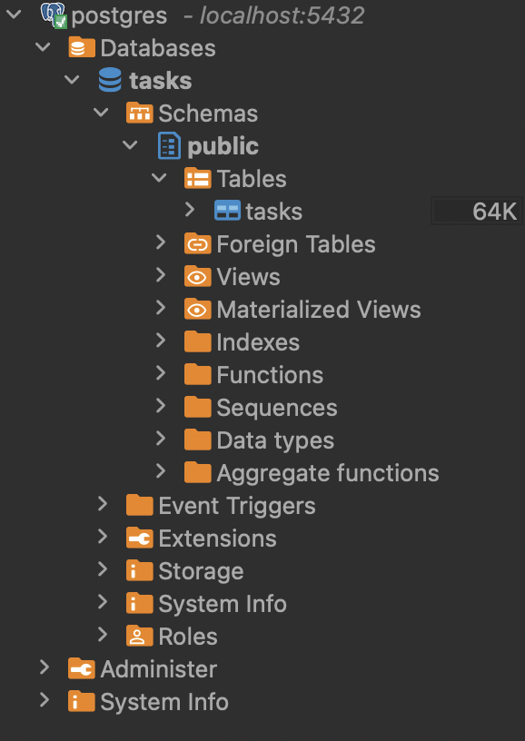

# Task Processing System

This is a microservice-based task processing system built with Python, FastAPI, Celery, RabbitMQ, PostgreSQL, and Docker. The system processes tasks asynchronously using background jobs managed by Celery, with task metadata stored in a PostgreSQL database. RabbitMQ serves as the message broker to handle task queuing and distribution.

## System Overview

1. **API Service**  
   - Exposes CRUD operations for tasks.
   - Sends jobs to RabbitMQ for background processing.
  
2. **Worker Service**  
   - Listens for jobs from RabbitMQ.
   - Processes tasks asynchronously using Celery.

3. **RabbitMQ**  
   - Message broker for task distribution and queuing.

4. **PostgreSQL**  
   - Stores task metadata, including task status and details.

## Folder Structure
```markdown
message_queue/
│── api/
│   ├── main.py   # FastAPI app with CRUD endpoints
│   ├── db.py     # Database connection setup
│   ├── models.py # SQLAlchemy models for tasks
│   ├── schemas.py # Pydantic schemas for validation
│   ├── worker.py # Celery worker to process background jobs
│── docker-compose.yml  # Docker Compose configuration
│── Dockerfile.api      # Dockerfile for API service
│── Dockerfile.worker   # Dockerfile for worker service
│── requirements.txt    # Python dependencies
```

## How to Run

### Prerequisites

- **Docker** and **Docker Compose** must be installed on your system.

### 1. Start all services

Navigate to the project directory and use Docker Compose to build and start the services:

```bash
docker-compose up --build
```

2. Access RabbitMQ UI
	•	Open RabbitMQ Management UI in your browser: http://localhost:15672/
	•	Login with username: guest and password: guest

3. Test API Endpoints

You can interact with the API using curl or any API client like Postman.

Create a new task:

```bash
curl -X POST "http://localhost:8000/tasks/" -H "Content-Type: application/json" -d '{"name": "Process Data"}'
```

Get task status:
```bash
curl -X GET "http://localhost:8000/tasks/1"
```

📌 Key Features
	•	CRUD API: Create and retrieve tasks.
	•	Message Queue (RabbitMQ): Ensures tasks are processed asynchronously.
	•	Job Scheduler (Celery): Executes background tasks.
	•	Microservices Architecture: API and worker services run independently.
	•	Dockerized: Easy deployment with docker-compose up.


## Additional feature.

### 1. Using DBeaver (Cross-Platform GUI)

DBeaver is a free, open-source database management tool.

Step 1: Install DBeaver

Download from [Download DBeaver](https://dbeaver.io/download/).

Step 2: Connect to PostgreSQL
```markdown
	•	Open DBeaver.
	•	Click New Database Connection → Select PostgreSQL.
	•	Enter:
	•	Host: localhost (or host.docker.internal for macOS/Windows)
	•	Port: 5432
	•	Database: Your database name
	•	Username: postgres
	•	Password: Your password
	•	Click Test Connection, then Finish.
```

Step 3: View the task table in the DBeaver



Step 4: Start creating a new task with postman and results are visible in the task table.
